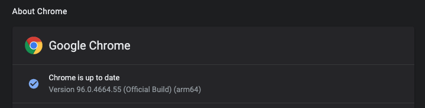

# StateLegiscraper 


A text webscraping tool for U.S. state legislature websites, with options for speech-to-text generated transcripts and public-facing example dashboards that include basic text analysis on specific policy areas.

Current coverage includes Nevada and Washington.

## Mission

The mission of StateLegiscraper is to build and make accessible text corpora of political, social, and scholarly significance that can build greater public transparency and academic knowledge about public policymaking and state-level politics. 

## Project Objective

In recent years, a number of controversial bills and policy proposals have emerged in state legislatures and media attention has increasingly focus on state legislative politics. But beyond recent news, public oversight of the policymaking process is an important cornerstone of democratic nations. As the current U.S. political climate has increasingly shifted national politics to the state-level, state legislatures are key policy venues to watch.

However, each of the 50 state legislatures have vastly different websites and public documentation protocols. Therefore, a systemic examination of national trends at the state-level is difficult to execute due to challenges in navigating, accessing, and processing relevant data. While projects such as [LegiScan](https://legiscan.com), [Civic Eagle](https://www.civiceagle.com/), and [Open States](https://openstates.org/) have APIs that provide data about bills and representatives across all 50 states, there is currently no open source option that scrapes and processes written and spoken transcripts of state legislature commitee hearings and floor speeches for research purposes and public review. 

## Repository Structure
 ```
.
├── StateLegiscraper
│   ├── states
│   ├── test
│   └── dashboard_helper.py
├── data
│   ├── dashboard
│   └── states
├── doc
├── examples
├── LICENSE
├── README.md
├── app.py
├── environment.yml
├── requirements.txt
└── travis.yml
 ```
The `StateLegiscraper` directory includes a `states` module, unit tests in `test`, and a `dashboard_helper` function script. Data relevant to dashboard and the states module are included in `data` directory. The `examples` directory provides example Jupyter notebooks that can help new users learn the ways StateLegiscraper organize scraping and processing. A Plotly Dash dashboard can run locally through the `app.py` file (see [Dashboard](https://github.com/ka-chang/StateLegiscraper/blob/main/README.md#dashboard) section below for details.

## Requirements

StateLegiscraper primarily uses a Python-based web browser automation tool, [Selenium](https://www.selenium.dev), to conduct webscraping. This requires a specific browser and browser driver to work properly. The package is built using Google Chrome.

- Python = 3.7
- [Google Chrome](https://www.google.com/chrome/)  
- [Chrome Driver](https://chromedriver.chromium.org/downloads)

To check your installed Chrome version and to download the appropriate Chrome Driver, follow these instructions:
1. Open Google Chrome
2. At the top right corner of the browser, click the settings tab (three vertical dots ⋮)
3. Navigate down to Help > About Google Chrome
4. Your Google Chrome version is listed on the top of the page. For example:



5. Find the [Chrome Driver](https://chromedriver.chromium.org/downloads) that corresponds to your version and save it to your local drive

## Installation

StateLegiscraper is installed using the command line and is best used with a virtual environment due to its dependencies.

1. Open your choice of terminal (e.g., Terminal (MacOS) or [Ubuntu 20.04 LTS](https://www.microsoft.com/en-us/p/ubuntu-2004-lts/9n6svws3rx71?activetab=pivot:overviewtab) (Windows))
2. Clone the repoistory using `git clone https://github.com/ka-chang/StateLegiscraper.git`
3. Change to the StateLegiscraper repository using `cd StateLegiscraper`
4. Set up a new virtual environment using `conda create –n statelegiscraper python=3.7`
5. Activate the statelegiscraper virtual environment with `conda activate statelegiscraper`
6. Install package requirements using `pip3 install –r requirements.txt`

## Usage

### Tool

StateLegiscraper contains U.S. state-specific modules that each contain two classes of functions: a Scrape class and a Process class. 

- The Scrape class bundles functions that scrape U.S. state legislature websites for individual committee hearing and floor speech PDF / audio / video transcript links. Users export this raw data to their local drive or a mounted cloud drive.
- The Process class bundles functions that cleans and formats the raw scraped data into Python objects appropriate to use for popular NLP packages (e.g., nltk, SpaCy). Scraped PDF files will be converted to dictionary objects, while audio and video files will use Deep Speech, an open-source speech-to-text engine, to generate a text transcript of selected meetings. These transcripts can be used as dictionary objects, or exported as a JSON file.

Example Jupyter notebooks are provided in the [examples directory](https://github.com/ka-chang/StateLegiscraper/tree/main/examples) that walk new users through StateLegiscraper's scrape and process functions, including expected behavior from Selenium and file management strategies.

### Dashboard

StateLegiscraper also includes a series of public-facing dashboards using the scraped state legislature data. These dashboards  provide interested users about high-level narrative trends within a specific state and/or policy area. 

- COVID-19 Narrative Trends in Nevada's Health and Human Services Committee (2020) 

To run the dashboard, ensure you have cloned the StateLegiscraper repository and are located in the root directory. Type in `python app.py` in your terminal and the dashboards will open in a separate browser.

## Use Cases

Researchers can gather raw data for nuanced, tailored analysis, while journalists and members of the public can engage with our text analysis dashboards to capture high-level trends in the political discourse at the state legislature.

## Requests 
The ambition of StateLegiscraper is to one day cover and maintain all 50 state legislature websites. If you'd like to request a state, build a dashboard, or suggest a feature to extend the functionality of StateLegiscraper, please feel free to [raise an issue](https://github.com/ka-chang/StateLegiscraper/issues). 

## Bug Report
If you would like to report a bug or issue , please submit a detailed report at [this link](https://github.com/ka-chang/StateLegiscraper/issues/new).
 
## Contributions
If you'd like to expand StateLegiscraper to other states, use the data to add to our dashboard options, or add additional features to the tool, please fork the repository, add your contribution, and generate a pull request. The complete contributing guide can be found at this [link](https://github.com/ka-chang/StateLegiscraper/blob/main/doc/CONTRIBUTING.md). This project operates under the [Contributor Code of Conduct](https://www.contributor-covenant.org/version/1/0/0/code-of-conduct/).

## Acknowledgements
Many thanks to Dr. David Beck and Anant Mittal from the University of Washington for their support, guidance, and feedback in the development of this package.
