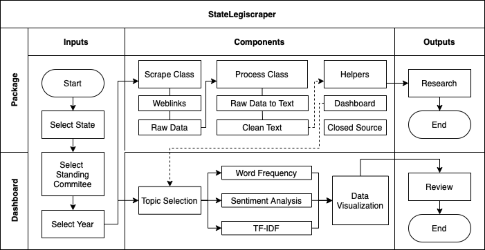

# StateLegiscraper Design Specification

</img>

A text webscraping tool for U.S. state legislature websites, with options for speech-to-text generated transcripts and public-facing example dashboards that include basic text analysis on specific policy areas.

Current coverage includes Nevada and Washington, with California in the design phase.

## Mission

The mission of StateLegiscraper is to make accessible text corpora of political, social, and scholarly significance that can build greater public transparency and academic knowledge about public policymaking and state-level politics. 

## Project Objective

In recent years, a number of controversial bills and policy proposals have emerged in state legislatures and media attention has increasingly focus on state legislative politics. But beyond recent news, public oversight of the policymaking process is an important cornerstone of democratic nations. As the current U.S. political climate has increasingly shifted national politics to the state-level, state legislatures are key policy venues to watch.

However, each of the 50 state legislatures have vastly different websites and public documentation protocols. Therefore, a systemic examination of national trends at the state-level is difficult to execute due to challenges in navigating, accessing, and processing relevant data. While projects such as [LegiScan](https://legiscan.com), [Civic Eagle](https://www.civiceagle.com/), and [Open States](https://openstates.org/) have APIs that provide data about bills and representatives across all 50 states, there is currently no open source option that scrapes and processes written and spoken transcripts of state legislature commitee hearings and floor speeches for research purposes and public review. 

## Components
</img>

**Component 1. Scraped Raw Data (Scrape Class)** 

- *Inputs*: Functions that include user selection of state of interest (of those available), chamber (state-specific equivalent of House and Senate), Committee (complete list), and Date (organized by legislative session year and limited by those available on the website).
- *Outputs*: User exports their selected raw data to their local drive or a mounted cloud drive

**Component 2. Cleaned Text Data (Process Class)** 

- *Inputs*: Functions that clean and format the raw scraped data into Python objects appropriate to use for popular NLP packages (e.g., nltk, SpaCy). 
- *Outputs*: Scraped PDF files will be converted to dictionary objects, while audio and video files will use Deep Speech, an open-source speech-to-text engine, to generate a text transcript of selected meetings. These transcripts are returned to the environment as dictionary objects, or exported as a JSON file.

**Component 3. Dashboard Helper (Helpers Module)**

- *Inputs*:  Functions that conduct further processing of scraped and processed StateLegiscraper data to work with Plotly Dash and nltk. Current Dashboard Helper functions employ sentence_transformer models to filter text relevant to the topic of interest. 
- *Outputs*: Back-end functions support text analysis to output to a front-end dashboard of text analytics visualizations on the topic selected for the state. Analysis categories include: word frequency and counts, sentiment analysis, and TF-IDF.

